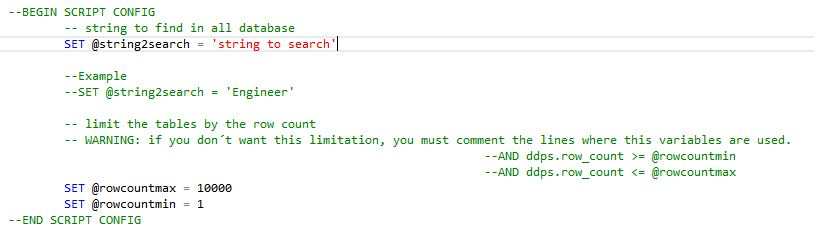
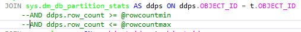
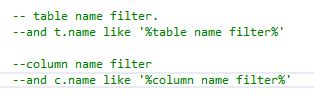
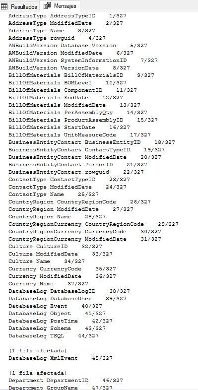
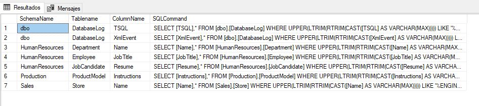
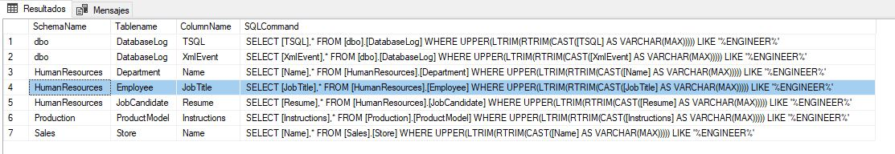
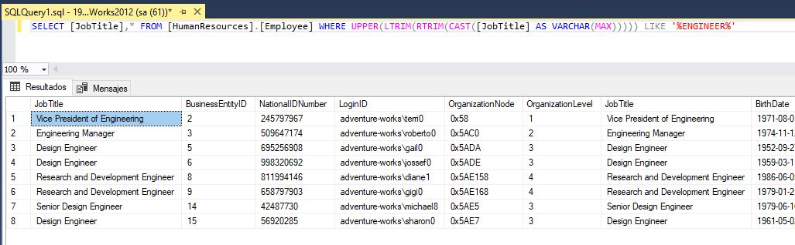

# Search a string in a database

This script search a string in every field of each table of a database.

## Setup the script

Type the string to search for

Because, the search in the database is very slow, you can limit the search in large tables
Whith this two variables, you can control the search in big tables, or tables with a minimun number of rows.
@rowcountmax = x
@rowcountmin = y
To deactivate this filter, just comment this two lines

Also, you can filter using table name or column name

The script, by default exclude numeric fields and other non string types, but you can activate it just comenting the desired part of code

## Executing the script
Just execute the scrip in SQL Server Management Studio or anothe database query tool

The searching progres give you feedback showing then current number of total

## Result

The final result is a select, with al tables and fields where process has find the given string

Just copy the autogenerated sql command, paste in another sql manager tab and execute it. The first field of select, match the search string, it includes also all of the fields.

Select result

For the examples I used Adventureworks database from Microsoft.
[Download Adventureworks](https://docs.microsoft.com/es-es/sql/samples/adventureworks-install-configure?view=sql-server-ver15&tabs=ssms)
